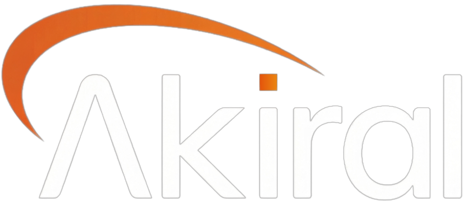

<div align="center">

<br/>



<br/><br/>

# AKIRAL — Enterprise Technological Infrastructure

**AI-powered automation platform that scales companies 10× faster.**  
Built with Next.js 16, React 19, Tailwind CSS, and Framer Motion.

<br/>

[](https://nextjs.org/)
[](https://react.dev/)
[](https://www.typescriptlang.org/)
[](https://tailwindcss.com/)
[](https://www.framer.com/motion/)
[](LICENSE)

<br/>

```
 ░█████╗░██╗░░██╗██╗██████╗░░█████╗░██╗░░░░░
 ██╔══██╗██║░██╔╝██║██╔══██╗██╔══██╗██║░░░░░
 ███████║█████╔╝░██║██████╔╝███████║██║░░░░░
 ██╔══██║██╔═██╗░██║██╔══██╗██╔══██║██║░░░░░
 ██║░░██║██║░╚██╗██║██║░░██║██║░░██║███████╗
 ╚═╝░░╚═╝╚═╝░░╚═╝╚═╝╚═╝░░╚═╝╚═╝░░╚═╝╚══════╝
```

</div>

---

## 📋 Table of Contents

- [Overview](#-overview)
- [Live Demo](#-live-demo)
- [Tech Stack](#-tech-stack)
- [Project Structure](#-project-structure)
- [Features](#-features)
- [Sections](#-sections)
- [Getting Started](#-getting-started)
- [Changelog](#-changelog)
- [Roadmap](#-roadmap)

---

## 🚀 Overview

AKIRAL is a **high-performance marketing website** for an enterprise AI automation company. It showcases AI agents, automation solutions, and measurable results through a dark, premium design aesthetic.

The site is fully **bilingual (PT/EN)**, fully **responsive (mobile-first)**, and built for performance with zero layout shift, smooth scroll animations, and CSS-only auto-scrolling testimonials.

---

## 🌐 Live Demo

> Production site is deployed at your preferred hosting provider (Vercel recommended).

```bash
npm run dev   # http://localhost:3000
```

---

## 🛠 Tech Stack

| Layer | Technology |
|-------|-----------|
| **Framework** | [Next.js 16](https://nextjs.org/) (App Router + Turbopack) |
| **Language** | [TypeScript 5](https://www.typescriptlang.org/) |
| **UI Library** | [React 19](https://react.dev/) |
| **Styling** | [Tailwind CSS](https://tailwindcss.com/) + custom CSS |
| **Animations** | [Framer Motion 12](https://www.framer.com/motion/) + CSS keyframes |
| **Fonts** | [Inter](https://fonts.google.com/specimen/Inter) · [IBM Plex Mono](https://fonts.google.com/specimen/IBM+Plex+Mono) |
| **Icons** | Inline SVG (zero dependencies) |
| **Deployment** | [Vercel](https://vercel.com/) |

---

## 📁 Project Structure

```
webapp/
├── app/
│   ├── globals.css          # Design tokens, utility classes, animations
│   ├── layout.tsx           # Root layout, metadata, Google Fonts
│   └── page.tsx             # Entry point — assembles all sections, manages lang state
│
├── components/
│   ├── sections/
│   │   ├── Hero.tsx         # Full-screen hero with gradient headline & stats
│   │   ├── Resultados.tsx   # 4-column metric cards grid
│   │   ├── Solucoes.tsx     # Interactive product carousel (desktop 3-col / mobile Instagram)
│   │   ├── Depoimentos.tsx  # Auto-scrolling dual-row testimonials
│   │   ├── ComoFunciona.tsx # Zig-zag roadmap with 3 steps
│   │   └── Demo.tsx         # Final CTA section
│   │
│   └── ui/
│       ├── Header.tsx       # Fixed responsive navbar (desktop + mobile hamburger)
│       └── Footer.tsx       # Links grid + copyright bar
│
├── public/
│   └── logo.png             # AKIRAL brand logo
│
├── next.config.ts           # Next.js config (allowedDevOrigins, image domains)
├── tailwind.config.ts       # Tailwind theme extension
└── tsconfig.json            # TypeScript config
```

---

## ✨ Features

### 🎨 Design
- **Dark premium aesthetic** — `#0A0B0D` base with `#F26522` orange accent
- **CSS grid background** — subtle tech-grid pattern in hero section
- **Radial glow effects** — orange ambient lighting behind hero headline
- **Smooth fade-up animations** — IntersectionObserver-triggered reveal on scroll
- **Gradient text** — orange gradient on hero headline accent words

### 📱 Responsive
- **Mobile-first** design with breakpoints at 768px and 1024px
- **Mobile header** — hamburger menu that expands downward with smooth transition
- **Logo always left, hamburger always right** — no overlap on any screen size
- **Instagram-style carousel** on mobile Soluções — arrows on image sides, no text clutter

### 🌍 Bilingual (PT/EN)
- Language toggle in header (both desktop and mobile)
- Full translation of **every section**: Hero, Resultados, Soluções, Depoimentos, Como Funciona, Demo, Footer
- Language state lifted to root `page.tsx` and passed as `lang` prop

### ⚡ Performance
- `next/image` for optimized logo loading with `priority` flag
- CSS-only scrolling animations (no JS scroll listeners on testimonials)
- `IntersectionObserver` for efficient scroll-reveal
- Turbopack dev builds for instant HMR

---

## 📄 Sections

### 1. 🦸 Hero
Full-viewport section with orange radial glow, tech-grid background, animated badge, gradient headline, CTA button, trust badges, and live performance stats.

### 2. 📊 Resultados
4-column metric grid showing real KPIs: `87%` operational failure reduction, `99.97%` uptime, `10⁸` events/day, `<200ms` response time — each with industry tag pill.

### 3. 🛠 Soluções
Interactive product carousel:
- **Desktop**: 3-column layout — dimmed prev/next cards flank the active center card
- **Mobile**: Single card showing name + illustration with Instagram-style left/right arrows; long description hidden to avoid clutter

### 4. 💬 Depoimentos
Two infinite auto-scrolling rows of testimonial cards — row 1 scrolls left, row 2 scrolls right — with fade masks on edges. 8 unique testimonials from real-looking personas.

### 5. 🗺 Como Funciona
Zig-zag 3-step roadmap:
- **Step 01** (INÍCIO) — Schedule Free Demo — orange
- **Step 02** (EXECUÇÃO) — Implementation — blue
- **Step 03** (RESULTADO) — Scale — green

### 6. 📅 Demo
Final CTA section with Calendly link, session details (format, duration, profile target).

### 7. 🔗 Footer
Logo + tagline, 3-column link grid (Company / Akiral For / Resources), copyright bar with system status indicator.

---

## 🚀 Getting Started

### Prerequisites
- Node.js ≥ 18
- npm ≥ 9

### Install & Run

```bash
# Clone the repository
git clone https://github.com/devHoff/gensite.git
cd gensite

# Install dependencies
npm install

# Start development server
npm run dev
# → http://localhost:3000

# Build for production
npm run build
npm start

# Lint
npm run lint
```

### Environment
No environment variables required. The Calendly demo URL is hardcoded in each section component:
```
https://calendly.com/arthur-renck3/book-demo
```

---

## 📝 Changelog

### `v1.2.0` — 2026-03-02 *(latest)*
> **Mobile fixes, full bilingual support, Instagram-style product carousel**

#### 🐛 Bug Fixes
- **Header**: Removed hardcoded `height: 64px` from `.site-header` — it was clipping the mobile dropdown panel
- **Header mobile**: Logo no longer overlaps hamburger icon; logo is `flex-shrink: 0` far-left, hamburger uses `marginLeft: auto` far-right
- **Mobile dropdown**: Now correctly slides **downward** from the header bottom

#### 🎨 UI / Spacing
- **Hero top padding**: Reduced `3rem → 2rem` to eliminate excessive gap below header
- **Hero badge margin**: Reduced `1.75rem → 1.25rem`
- **Hero headline margin**: Reduced `1.5rem → 1.25rem`
- **Hero trust-badges margin**: Reduced `2.5rem → 1.75rem`

#### 🌍 Internationalization
- Added full **PT/EN translations** to all sections (previously only Header was translated):
  - `Resultados` — labels, metric tags, titles, descriptions
  - `Depoimentos` — section label, headline, all 8 testimonial quotes
  - `ComoFunciona` — label, headline, subtitle, step labels/titles/descriptions/items/CTA
  - `Demo` — label, headline, description lines, CTA button, detail cards
  - `Footer` — section headings, all navigation links, status text
  - `Solucoes` — label, headline, both product names/subtitles/descriptions

#### 📱 Mobile — Soluções
- Added `sol-mobile-layout` CSS class (shown on `≤767px`, hidden on `≥768px`)
- Mobile card shows **only**: tag badge, product name, subtitle, illustration SVG
- Long prose description is **hidden on mobile** to reduce visual clutter
- **Instagram-style arrows**: Two circular buttons (`36×36px`, `rgba(0,0,0,0.55)`) positioned absolutely on the left and right sides of the illustration

---

### `v1.1.0` — 2026-02-28
> **Full site reconstruction to match reference design**

- Rebuilt all 8 sections from scratch matching the AKIRAL reference sandbox
- Implemented auto-scrolling testimonials (CSS-only, two rows)
- Built zig-zag roadmap with SVG connecting arrows
- Added fade-up scroll-reveal animations site-wide
- Implemented `lang` state in `page.tsx` and PT/EN toggle in Header

---

### `v1.0.0` — 2026-02-25
> **Initial commit**

- Next.js 16 project scaffold with TypeScript + Tailwind CSS
- Basic page structure and routing

---

## 🗺 Roadmap

```
2026 Q1 — DONE ✅
├── [x] Full site construction (Hero, Resultados, Soluções, Depoimentos, Como Funciona, Demo, Footer)
├── [x] Responsive mobile layout
├── [x] PT/EN bilingual support across all sections
├── [x] Mobile header fix (dropdown opens downward, no overlap)
└── [x] Instagram-style product carousel on mobile

2026 Q2 — IN PROGRESS 🔄
├── [ ] Contact / lead capture form (replace Calendly with native form + email)
├── [ ] Blog / case studies section
├── [ ] Animated counters for metric cards (count-up on scroll)
└── [ ] Dark/light mode toggle

2026 Q3 — PLANNED 📋
├── [ ] CMS integration (Sanity or Contentful) for testimonials & solutions
├── [ ] Multi-language support beyond PT/EN (ES, FR)
├── [ ] Performance audit & Core Web Vitals optimisation (target LCP < 1.2s)
└── [ ] Storybook component library

2026 Q4 — FUTURE 🔮
├── [ ] Interactive AI demo embed
├── [ ] Customer portal / dashboard teaser section
├── [ ] Video background option for hero
└── [ ] A/B testing infrastructure (Vercel Edge Config)
```

---

## 🎨 Design Tokens

| Token | Value | Usage |
|-------|-------|-------|
| `--color-bg` | `#0A0B0D` | Page background |
| `--color-surface` | `#111214` | Section backgrounds |
| `--color-card` | `#0D0F11` | Card backgrounds |
| `--color-border` | `#1E2024` | Borders, dividers |
| `--color-accent` | `#F26522` | Primary CTA, highlights |
| `--color-text` | `#F2F2F2` | Primary text |
| `--color-muted` | `#6B7280` | Secondary text |
| `--color-subtle` | `#B8BCC2` | Body copy |
| `--font-sans` | `Inter` | UI text |
| `--font-mono` | `IBM Plex Mono` | Labels, tags, stats |

---

## 📄 License

MIT © 2026 [AKIRAL](https://github.com/devHoff/gensite)

---

<div align="center">

**Built with precision. Shipped with purpose.**

*AKIRAL — Enterprise Technological Infrastructure*

</div>
